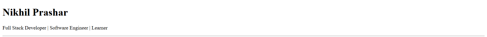
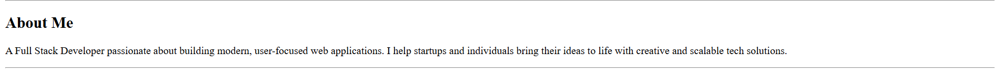
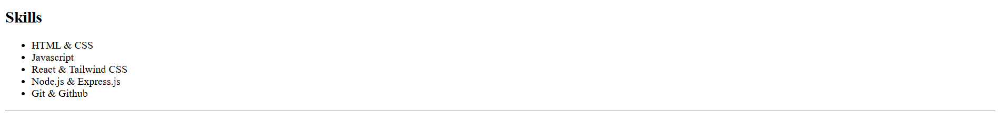
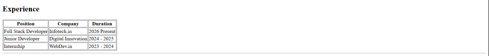
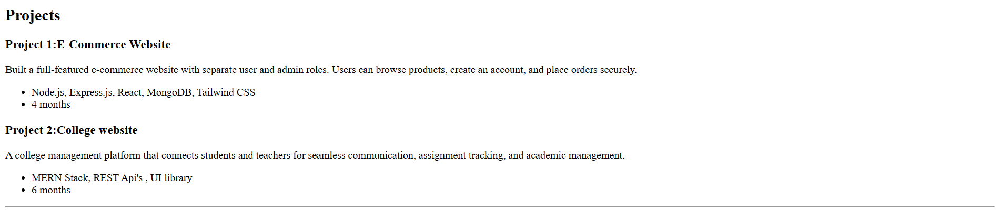
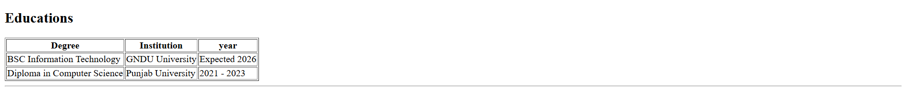
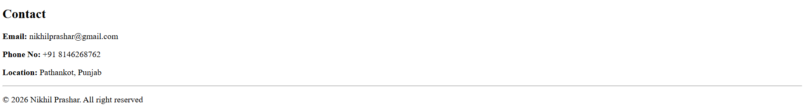

# HTML Resume Project

This project is a simple HTML resume page that I built to practice my HTML through a small project.

## Live Demo

You can view the hosted version of my resume here:  
https://prasharnikhilresume.netlify.app

---

## Project Overview

The goal of this project was to understand the basic structure of HTML.

---

## Step-by-Step Process

### Step 1: Create Project Folder
I created a new folder named `HTML` on my computer.

### Step 2: Open Folder in VS Code
I opened the folder in Visual Studio Code and created a file named `index.html`.

### Step 3: Setup Basic HTML Structure
I added the basic HTML boilerplate structure and set the page title as **My Resume** inside the `<head>` section.

### Step 4: Build Header Section
I created the header section and added:
- My name: **Nikhil Prashar**
- My professional title: **Full Stack Developer**

### Step 5: About Me Section
I added a short introduction about myself in the **About Me** section.

### Step 6: Skills Section
I listed all my technical skills in the **Skills** section.

### Step 7: Experience Section
I mentioned my previous work experience in the **Experience** section.

### Step 8: Projects Section
I added my two best projects in the **Projects** section with details.

### Step 9: Education Section
I included my academic background such as:
- Course name.
- Institution name.

### Step 10: Contact Section
I added my contact details so anyone can connect with me easily.

---

## Conclusion

This project helped me understand how a real-world HTML page is structured. Hope You Understand it .
